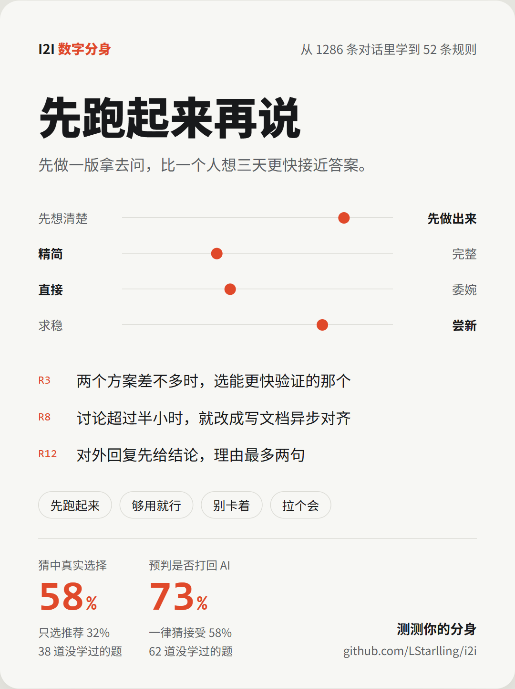

# I2I · 你的数字分身

**把你自己蒸馏成一个 if 语句。**

I2I 从你和 AI 的历史对话中，学会你的偏好和决策方式。纠结时，它直接告诉你"你会选什么"，给出把握度和依据；不知道怎么回消息时，它用你的语气写好候选回复。

你手写的 CLAUDE.md、AGENTS.md 记的是你**说**的偏好，从来没被测试过。I2I 从你**做**的选择里生成它，告诉你它有多准，再同步回你的 memory 文件。

它以 skill 的形式安装在你常用的 agent 里。所有数据只留在你的电脑上。

<p align="center"><br><sub>示例卡片（虚构数据）</sub></p>

```
你：下周的分享，讲新框架还是讲踩坑复盘？

分身：
选择：踩坑复盘
把握：74%
依据：R7 "汇报讲清为什么这么做，比讲做了什么更重要"；
      上个月你否掉过一版"功能罗列式"的周报
```

## 能做什么

| 场景 | 你说 | 分身给出 |
|---|---|---|
| 工作决策 | "方案 A 还是 B？" | 你会选哪个、把握度、依据 |
| 回复话术 | "老板这条消息怎么回？" | 2～3 条你语气的候选回复，并标出你最可能选哪条 |
| 生活纠结 | "周末去不去？" | 快速给出决定；没把握时直说，并告诉你卡在哪 |
| 交付前预审 | "审一下" | 按你的标准挑一遍毛病，先把你大概率会打回的问题改掉 |
| 少来问我 | （Claude Code 自动） | AI 要问你之前先问分身，把握高的直接按你的习惯选，只把没把握的问题留给你 |

把握度低于 60% 时，分身会说"这件事我替你判断不了"，而不是硬猜。

## 安装

**Claude Code**

```
/plugin marketplace add LStarlling/i2i
/plugin install i2i@i2i
```

**其他支持 SKILL.md 的 agent**（Codex 等）：把 `skills/i2i` 目录复制到该 agent 的 skills 目录下。

```
git clone https://github.com/LStarlling/i2i.git
cp -r i2i/skills/i2i ~/.codex/skills/   # 以 Codex 为例
```

需要 Python 3，不依赖任何第三方包。

## 开始使用

只需要记住一个命令：`/i2i`。不带参数会显示分身状态和菜单，选个数字就行；有事直接说，比如 `/i2i 周末去不去`、`/i2i 审一下`。下面是它能做的事：

1. 第一次运行 `/i2i`，选"建立分身"。它会读取本机的 AI 对话记录（目前支持 Claude Code 和 Codex），提炼出你的偏好规则。
2. 建档完成后自动校准，用两类没参与学习的真实记录考它：你做过的选择题，以及 AI 交出产出后你是接受还是打回。每个分数都和对应的基线对比，比如"只选 AI 推荐项""一律猜多数"。以后每次"更新分身"都会一步做完学习、校准、同步和刷新卡片。
3. 对话记录里生活类的内容少，可以做快问快答，用 5 分钟补齐。
4. 分身猜错时直接告诉它，这条纠正会立即更新规则。
5. 想让回复话术更像你，导入一些你和同事、朋友的聊天，方式见下方"导入聊天记录"。
6. 生成分享卡片，得到一张你的决策画像，截图即可分享。卡片会自动去掉公司、项目等内部信息。
7. 同步到 CLAUDE.md（或 AGENTS.md）后，把握度高的规则会写进你的 memory 文件，所有 agent 直接受益，见下方"同步到 memory 文件"。
8. Claude Code 下装好插件就自动学习（通过插件自带的钩子实现，其他 agent 需要你主动运行 `/i2i` 更新）：每次会话结束抽取新信号，下次会话开始提醒你一句。AI 要问你选择题时，也会先让分身判断，把握高的直接按你的习惯选，并在回复里注明，你不认可直接说。

## 同步到 memory 文件

分身学到的规则可以写进你的 CLAUDE.md、AGENTS.md 等 memory 文件，之后每次档案更新自动同步：

- 只写把握度高的规则，只维护文件里一对 I2I 标记之间的区块，你手写的内容一律不动。
- 你已经写过的规则不重复导出；和你手写规则**冲突**的也不导出，而是单独列出来。"你说的"和"你做的"不一致，往往是最值得看的发现。
- 第一次同步会先给你看导出内容，确认后才写入。要撤销时整块删除，手写内容不受影响。

不想写进 memory 文件的话，也可以只加一句：

```
拿不准我的偏好时，先查 ~/.i2i/profile.md，查不到再问我。
```

## 导入聊天记录

分身从你和 AI 的对话里学会的是决策方式；想让它写的回复话术像你对人说话，还需要一些你和别人的聊天。任选一种方式：

| 方式 | 怎么做 |
|---|---|
| 粘贴 | 在聊天软件里多选消息、复制，粘贴给 agent，说明这是要导入的聊天 |
| 截图 | 把聊天截图（长截图最好）存进 `~/.i2i/inbox/`，攒够了在 `/i2i` 菜单里选"导入聊天"，处理完的截图会被删除 |
| 导出文件 | 有 CSV 或 JSON 格式的聊天导出文件时，把路径给它。文件需要有内容列，以及"是否本人"列或"发送人"列 |
| 飞书（实验性） | 配置飞书官方 MCP 后，让它导入飞书消息，只导入你选定的会话 |

无论哪种方式，都只学习你本人发出的消息；对方的话只压缩成一句作为情境，并去掉人名、公司名、金额等细节。每类对象（上级、同事、朋友、家人）积累 50 条以上，话术才会比较像你。

<details>
<summary>飞书配置步骤</summary>

1. 在[飞书开放平台](https://open.feishu.cn/)创建企业自建应用，重定向 URL 填 `http://localhost:3000/callback`。
2. 开通权限：`im:message:readonly`、`im:message.p2p_msg:get_as_user`、`im:message.group_msg:get_as_user`、`im:chat:readonly`。企业租户下通常需要管理员审批。
3. 在 agent 中添加[飞书官方 MCP](https://github.com/larksuite/lark-openapi-mcp)，以 Claude Code 为例：

```
npx -y @larksuiteoapi/lark-mcp login -a <app_id> -s <app_secret>
claude mcp add lark-mcp -- npx -y @larksuiteoapi/lark-mcp mcp -a <app_id> -s <app_secret> --oauth --token-mode user_access_token -t im.v1.chat.list,im.v1.message.list
```

</details>

## 升级

插件不会自动更新。Claude Code 里执行 `/plugin marketplace update i2i`，再执行 `/plugin update i2i@i2i`；手动复制安装的重新复制 `skills/i2i` 目录即可。升级后不需要任何操作，原有的档案和成绩都会保留，新功能会自动作用于之后的数据。如果想让新规则也用到历史数据上（比如马上得到打回题的成绩），可以对 agent 说"重建档案"：它会用已存的全部数据重新提炼，不需要重新答题，旧档案会自动备份。

## 它是怎么学的

1. **抽取**：从对话记录中找出你做选择、否决、纠正 AI 的时刻。这些是你真正在做决策的地方。
2. **提炼**：把反复出现的选择总结成规则。每条规则带证据和把握度，可以追溯到具体哪次对话。
3. **校准**：一半的真实选择题、两成对 AI 的反应不参与学习，专门用来考分身。打回题先预测、后对照真实回复标注，脚本会检查先后顺序，所以分数不是自己给自己打的。

分身档案是一个 Markdown 文件（`~/.i2i/profile.md`），你可以直接阅读和修改。

## 隐私

- 所有数据存放在 `~/.i2i/`。I2I 不会把数据发到任何第三方服务，分析由你的 agent 调用它本来就在用的模型完成。
- 不读取、不解密任何聊天软件的本地数据库。聊天内容只来自你主动提供的粘贴文本、截图、导出文件，或你本人授权的官方接口。
- 抽取时自动脱敏常见的密钥和令牌。
- 导入聊天记录时，只学习你本人发出的消息。
- 删除 `~/.i2i/` 目录即可清除全部数据。

## 路线图

- [x] 可分享的分身画像卡片
- [x] 通过粘贴、截图、导出文件导入任意聊天工具的对话
- [x] 通过飞书官方接口导入消息（实验性）
- [ ] 支持更多 AI 对话记录：Cursor、ChatGPT 和 Claude 导出
- [x] 会话结束时自动抽取新信号（Claude Code）
- [x] AI 提问前先让分身回答（Claude Code）
- [x] 用"你会不会打回 AI 的方案"扩充评测题
- [x] 同步到 CLAUDE.md / AGENTS.md
- [x] AI 交付前，由分身按你的标准先挑一遍毛病

## License

MIT
